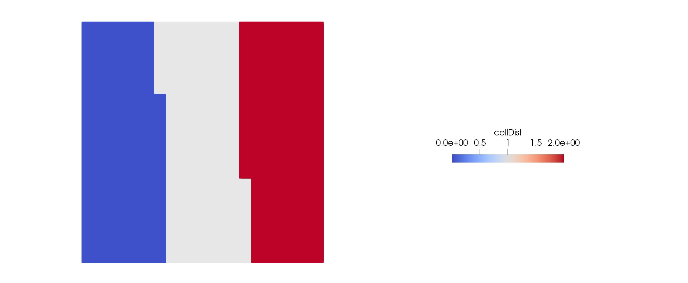
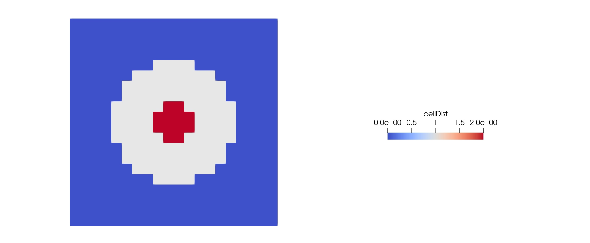

# A OpenFOAM Tutorial with Manual Defined Parallel Decomposition

*Cavity_SelfDecomposePar* is based on *cavity*, a tutorial of OpenFOAM whose file path is $FOAM_TUTORIALS/incompressible/icoFoam/cavity/cavity.

This tutorial shows how to get a self-defining parallel decomposition with *decomposeParDict* and *setFieldsDict* for better load balancing.

## How to run
1. `cd SelfDecomposePar` and `wmake` to compile self-defining program SelfDecomposePar.C.
2. Edit *decomposeParDict_simple*, *decomposeParDict_manual* and *setFieldsDict* according to your specific requirements.
(Note: The *numberOfSubdomains* in *decomposeParDict_simple* is equal to the number of regions you want.)
3. `./AllSelfDecomposePar` to decompose.
4. Parallel solving.
5. `./Allclean` to remove unnecessary files and folders

## Comparison of decompositions
- Simple Decomposition

- Manual Decomposition

It would be appreciated to contact me (xinzq@zju.edu.cn) if you find any unreasonably written code or problem about the tutorial.

## Reference
1. https://blog.csdn.net/CloudBird07/article/details/105349031 
2. https://www.openfoam.com/documentation/guides/latest/man/setFields.html
